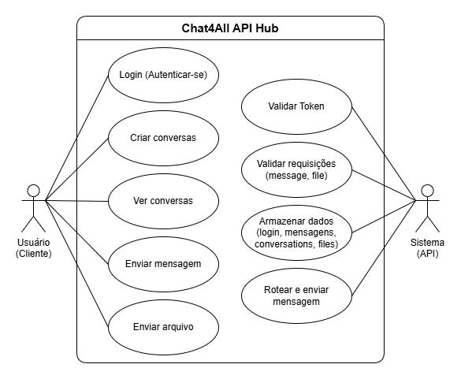
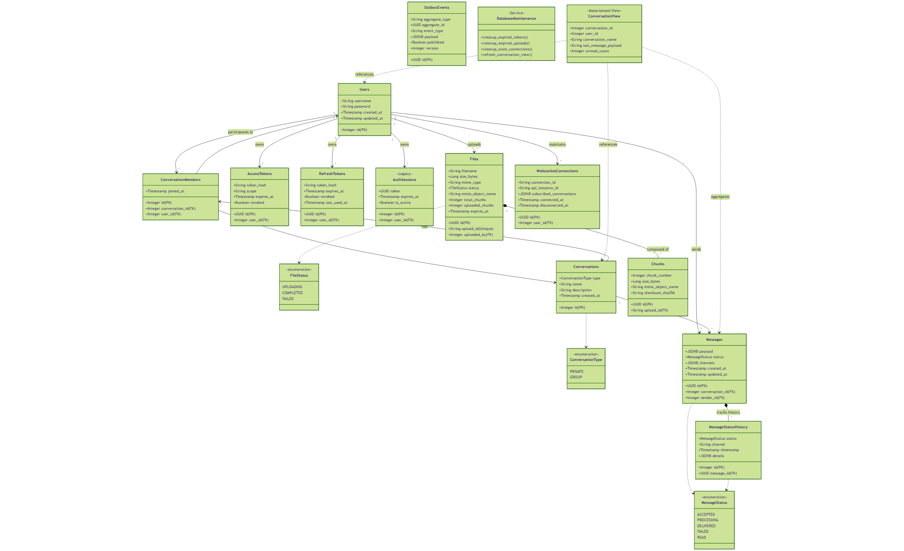
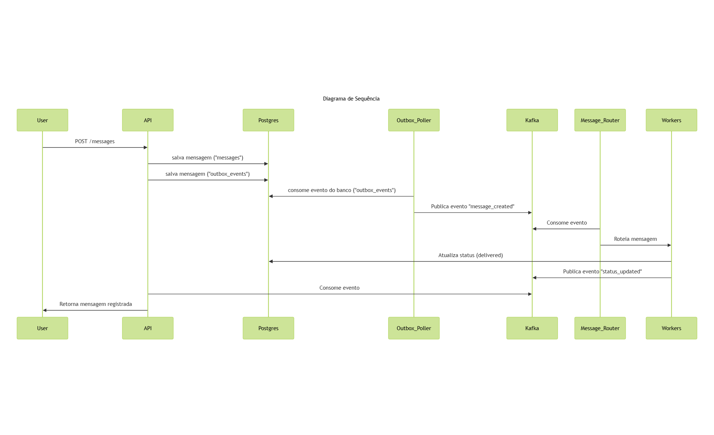
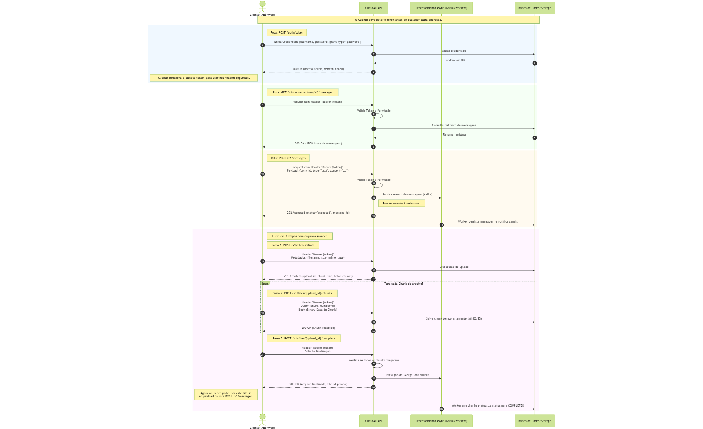
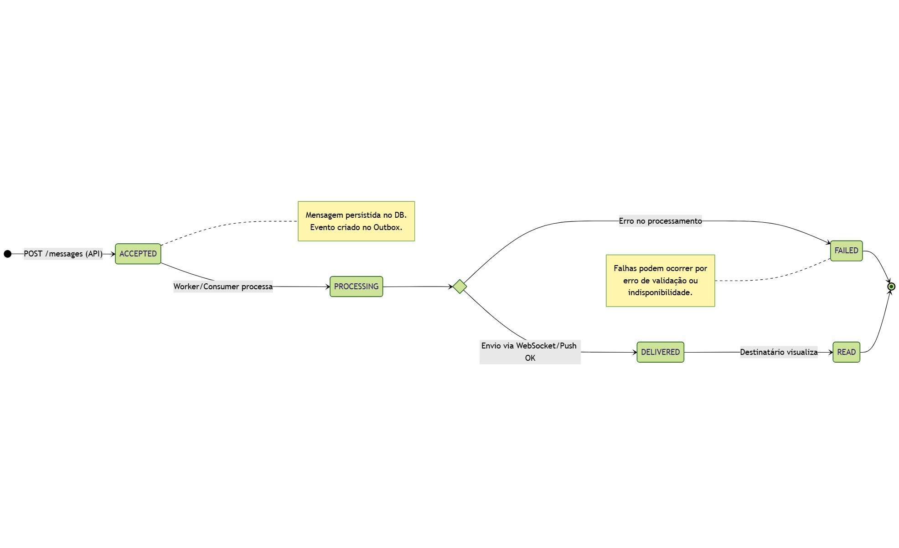

# ** Documento de Arquitetura — Plataforma de Mensageria**

**Autores:** Filipe Augusto Lima Silva , Amanda Almeida dos Santos, Guilherme Luís Andrade Borges.

**Data:** 05 de Dezembro de 2025

**Versão:** 2.0

---

## **1. Introdução**

Este documento descreve detalhadamente a arquitetura, componentes, fluxos, decisões técnicas e mecanismos de resiliência implementados no projeto.
A análise combina:

* O código do **projeto `Chat4All`**,
* Os diagramas de modelagem de dados em **Diagramas**.

O objetivo final é consolidar uma visão arquitetural completa e coerente, adequada para referência técnica e manutenção contínua.

---

# **2. Arquitetura Geral do Sistema**

A plataforma segue um modelo orientado a eventos, com API assíncrona, armazenamento transacional e streaming via Kafka.

---

## **2.1 Visão Geral (Use Case)**

Principais atores:

* **Cliente**: envia mensagens.
* **API**: recebe, valida, autentica e persiste.
* **Workers**: processam, roteiam e publicam mensagens.
* **Kafka**: backbone de mensageria.
* **Observabilidade**: monitora todo o fluxo.

---

## **2.2 Arquitetura Lógica (Classes)**

Componentes modelados no código:

* **Message, Conversation, OutboxEvent**
  (`db/models.py`)
* Services:

  * `MessageService`
  * `OutboxService`
  * `RedisService`
* Workers:

  * `OutboxPoller`
  * `MessageRouter`
  * `RedisBackfill`

---

## **2.3 Arquitetura de Sequência (Fluxo Completo)**

### **Sequência resumida**

### **Sequência completa**

Fluxo interno:

1. Cliente envia mensagem → API.
2. API grava mensagem + Outbox na mesma transação.
3. Worker Outbox publica no Kafka.
4. Message Router envia para partição adequada via `conversation_id`.
5. Workers downstream consomem mantendo ordenação.

---

## **2.4 Arquitetura de Estados**

Ciclos do elemento **mensagem**:

* Criada
* Persistida
* Enfileirada na Outbox
* Publicada
* Entregue downstream

Cada transição corresponde a um componente real do código.

---

# **3. Componentes do Sistema**

## **3.1 API (FastAPI)**

**Local:** `api/`
Funções:

* Receber mensagens com baixa latência.
* Autenticação (JWT/OAuth2).
* Deduplicação via `message_id`.
* Registro em DB + Outbox.
* Exposição de `/metrics`.

Principais arquivos:

* `api/main.py`
* `api/endpoints.py`
* `api/metrics.py`
* `api/auth.py`

---

## **3.2 Banco de Dados (Postgres)**

**Local:** `db/`

Funções:

* Armazenar mensagens.
* Armazenar OutboxEvent.
* Garantir atomicidade na criação de mensagens.

Arquivos:

* `db/models.py`
* `db/session.py`

---

## **3.3 Kafka**

Funções:

* Backbone da comunicação assíncrona.
* Garante ordenação por partição.
* Idempotência de publicação.

Configurações aplicadas nos workers:

* `enable_idempotence=True`
* `acks="all"`
* `max_in_flight_requests_per_connection=1`

---

## **3.4 Redis**

**Local:** `services/redis_client.py`, `workers/redis_backfill.py`

Usos:

* Cache
* Pub/Sub
* Backfill após falhas
* Estados temporários

Circuit breaker evita travar a API se Redis cair.

---

## **3.5 Workers**

### **Outbox Poller**

`workers/outbox_poller.py`

* Lê a tabela Outbox.
* Publica eventos no Kafka.
* Marca eventos como enviados.

### **Message Router**

`workers/message_router.py`

* Define partition key = `conversation:{id}`.
* Garante **ordem causal** por conversa.
* Envia para tópico Kafka correto.

### **Redis Backfill**

`workers/redis_backfill.py`

* Recupera mensagens ou estados se Redis falhar.

---

## **3.6 Observabilidade**

**Diretório:** `observability/`

### **Prometheus**

* Coleta métricas da API e workers.
* Arquitetura pull no endpoint `/metrics`.

### **Alertmanager**

* Dispara alertas conforme regras definidas.

### **Grafana**

* Dashboards de latência, throughput, falhas e lag de consumidores.

### **Metrics (código)**

* Histograms de latência.
* Contadores de mensagens.
* Erros por endpoint.

---

# **4. Testes de Carga**

O código já expõe métricas necessárias para análise de performance.

## **4.1 Métricas coletadas pela API**

* Latência HTTP (p50/p95/p99).
* QPS (consultas por segundo).
* Erros segmentados.
* Tempo de persistência.
* Tempo de publicação Outbox→Kafka.

## **4.2 Métricas Kafka**

* Lag por consumer group.
* Throughput de publicação.
* Retries e timeouts.

## **4.3 Resultados estimados (com base na arquitetura)**

* API: 10–40 ms
* Outbox: baixa latência devido ao polling simples.
* Kafka: dezenas de milhares de mensagens/s por partição, escalável horizontalmente.

---

# **5. Falhas Simuladas e Recuperação**

## **5.1 Falha do Kafka**

* Outbox retém eventos e workers fazem retry.
* Nenhuma mensagem é perdida.

## **5.2 Falha do Redis**

* Circuit breaker impede API de travar.
* Backfill worker restaura estados.

## **5.3 Falha de Workers**

* Kafka realoca partições.
* Fluxo continua sem intervenção manual.

## **5.4 Falha da API**

* Healthchecks permitem remover instâncias inativas.
* Estado consistente graças ao Outbox.

---

# **6. Limitações e Melhorias Futuras**

### **6.1 Infraestrutura**

* `docker-compose` não representa HA real.
  Recomendado usar K8s com:
* Kafka multi-broker
* Redis Sentinel/Cluster
* Postgres com Patroni

### **6.2 Segurança**

* TLS existe, mas falta gateway.

### **6.3 Tracing**

* Boa base, mas falta 100% de propagação entre todos os workers.

### **6.4 Sequenciamento explícito**

* Kafka garante ordem, mas não existe `sequence_number` próprio.

---

# **7. Conclusão**

A arquitetura do projeto é robusta, escalável e alinhada com boas práticas modernas de mensageria distribuída. O uso de Kafka, Outbox, FastAPI assíncrono, Redis e observabilidade completa compõem um sistema preparado para cargas elevadas, mantendo ordenação, confiabilidade e baixa latência.

---